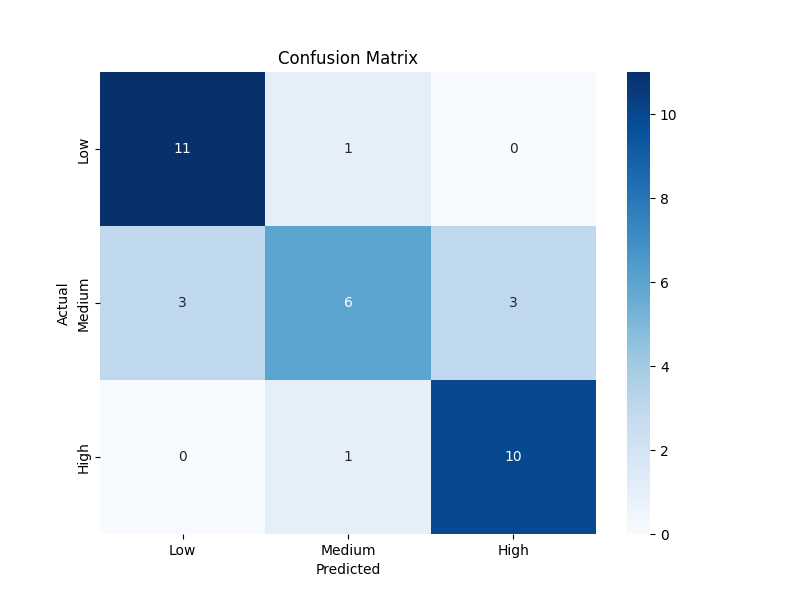
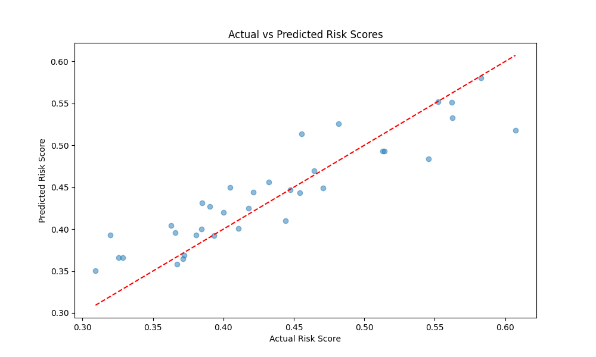
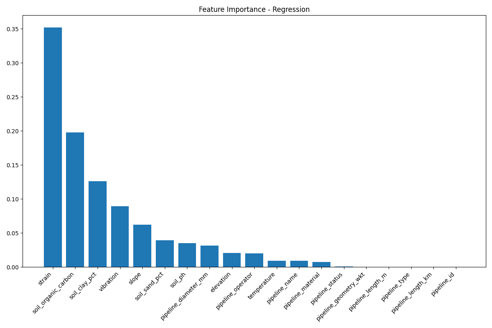
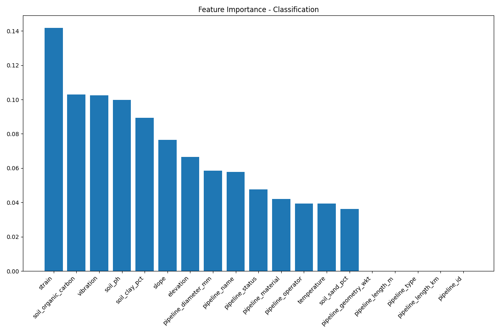

# Pipeline Risk Analysis Tool

### System Dependencies

**Windows:**
- Install [Microsoft Visual C++ Build Tools](https://visualstudio.microsoft.com/visual-cpp-build-tools/)
- Install [Git for Windows](https://git-scm.com/download/win)

**Ubuntu/Debian:**
```bash
sudo apt-get update
sudo apt-get install -y python3-pip python3-venv git
# For GeoPandas dependencies
sudo apt-get install -y libspatialindex-dev libgeos-dev libproj-dev
```

**macOS (using Homebrew):**
```bash
brew install python@3.9
brew install geos proj spatialindex
brew install git
```

## Quick Start

1. **Clone the repository**:
   ```bash
   git clone https://github.com/enjjalal/pipe_line_risk_analysis.git
   cd pipe_line_risk_analysis
   ```

2. **Set up the environment**:
   ```bash
   # Create and activate virtual environment
   python -m venv .venv
   .venv\Scripts\activate  # Windows
   # OR
   source .venv/bin/activate  # macOS/Linux

   # Install requirements
   pip install -r requirements.txt
   ```

3. **Run the analysis**:
   ```bash
   python spatial_risk_analysis.py
   ```

4. **View results** in the `visibles` directory

## Usage

### Running the Analysis

1. Ensure your input data is in the `integrate` directory
2. Run the analysis script:
   ```bash
   # Basic usage
   python spatial_risk_analysis.py
   
   # For large datasets, you can process in chunks
   python spatial_risk_analysis.py --chunk-size 1000
   
   # To specify custom output directory
   python spatial_risk_analysis.py --output-dir ./custom_output
   ```

### Verifying the Installation

Run the test suite (if available):
```bash
python -m pytest tests/
```

### Common Commands

- Update the repository:
  ```bash
  git pull origin main
  pip install -r requirements.txt  # If requirements changed
  ```
  
- Run the machine learning pipeline:
  ```bash
  python pipeline_ml_model.py
  ```

## Key Visualizations

### 1. Correlation Analysis

*Figure 1: Pearson correlation heatmap showing relationships between risk factors*

### 2. Spatial Risk Distribution

*Figure 2: Geographic visualization of pipeline risk scores (red = high risk, blue = low risk)*

### 3. Machine Learning Results

#### Classification Performance

*Figure 3: Confusion matrix showing classification performance*

#### Regression Predictions

*Figure 4: Actual vs. predicted risk scores from the regression model*

#### Feature Importance
<div style="display: flex; justify-content: space-between;">
  
  
</div>
*Figure 5: Feature importance for regression (left) and classification (right) models*

## Interpreting Results

- **Risk Scores**: Range from 0 (low risk) to 1 (high risk)
- **High-Risk Segments**: Defined as segments with risk scores above the 67th percentile
- **Correlation Values**: Range from -1 (perfect negative) to +1 (perfect positive)

## Output Files

- `visibles/spatial_risk_map.png`: Geographic visualization of risk scores
- `visibles/pearson_correlation_heatmap.png`: Correlation matrix of risk factors
- `visibles/high_risk_segments.geojson`: GIS data of high-risk segments
- `visibles/segment_risk_statistics.txt`: Summary statistics
- `ml_results/`: Contains trained models and ML evaluation metrics

## Common Issues

- **Installation Problems**:
  ```bash
  # On Windows, install C++ build tools first:
  # https://visualstudio.microsoft.com/visual-cpp-build-tools/
  
  # Then install requirements:
  pip install --upgrade pip
  pip install -r requirements.txt
  ```

- **Running out of memory**:
  ```bash
  # Process in smaller chunks
  python spatial_risk_analysis.py --chunk-size 1000
  ```

For additional help, please [open an issue](https://github.com/enjjalal/pipe_line_risk_analysis/issues)

## License

[MIT]

## Contact

[enj_jalal@yahoo.com]
