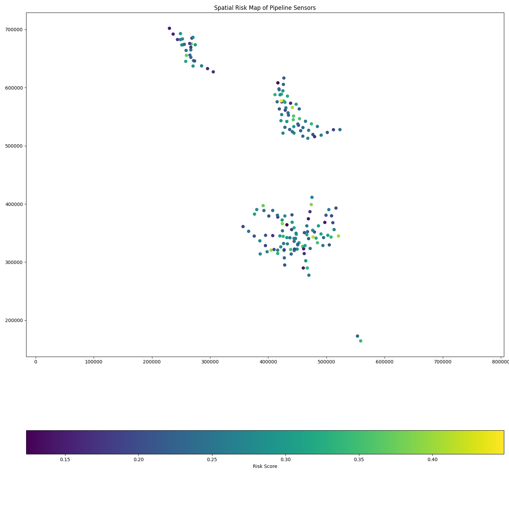
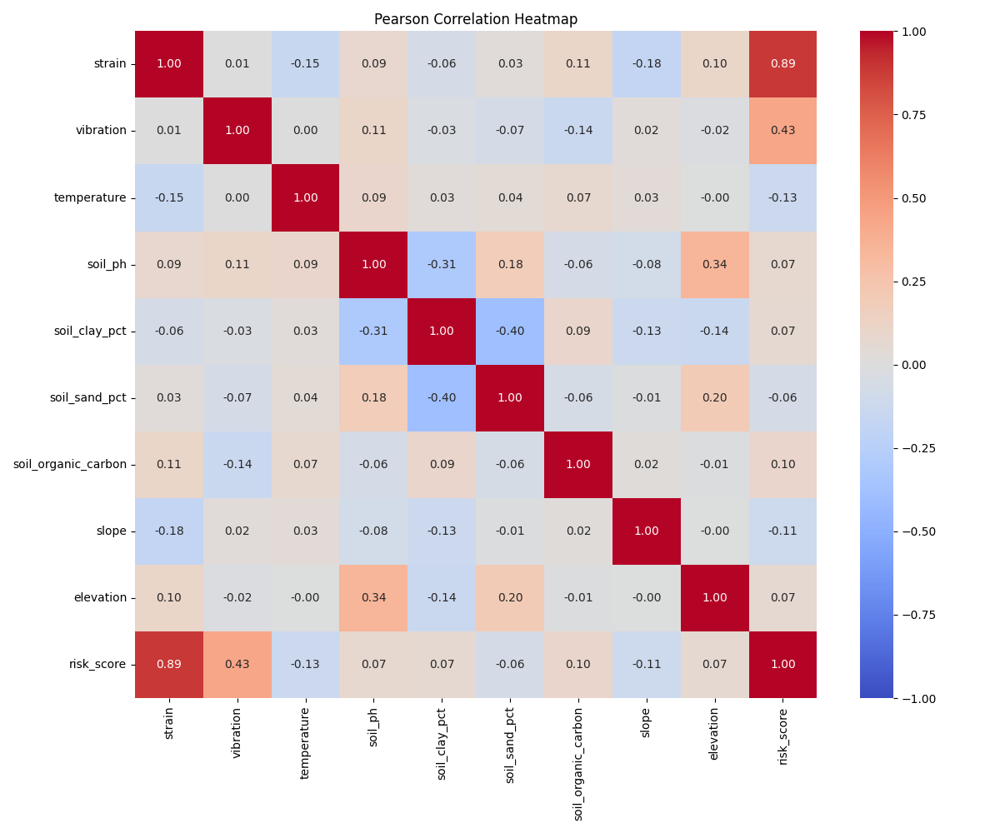

# Pipeline Risk Analysis Tool

This tool performs spatial risk analysis on pipeline infrastructure using sensor data, soil properties, and terrain features to identify high-risk segments that may require maintenance or monitoring.

## Features

- **Risk Score Calculation**: Computes risk scores based on multiple factors
- **Correlation Analysis**: Identifies relationships between different risk factors
- **Spatial Visualization**: Generates maps showing risk distribution
- **Segment Analysis**: Breaks down pipelines into manageable segments for detailed inspection
- **Reporting**: Produces comprehensive reports and visualizations

## Prerequisites

- Python 3.8+
- Git
- Windows/macOS/Linux (tested on Windows 10/11, Ubuntu 20.04+)
- At least 4GB RAM (8GB recommended for larger datasets)
- 500MB free disk space

### System Dependencies

**Windows:**
- Install [Microsoft Visual C++ Build Tools](https://visualstudio.microsoft.com/visual-cpp-build-tools/)
- Install [Git for Windows](https://git-scm.com/download/win)

**Ubuntu/Debian:**
```bash
sudo apt-get update
sudo apt-get install -y python3-pip python3-venv git
# For GeoPandas dependencies
sudo apt-get install -y libspatialindex-dev libgeos-dev libproj-dev
```

**macOS (using Homebrew):**
```bash
brew install python@3.9
brew install geos proj spatialindex
brew install git
```

## Installation

### Option 1: Using run_analysis.bat (Windows)

1. Download and extract the repository or clone it:
   ```bash
   git clone https://github.com/enjjalal/pipe_line_risk_analysis.git
   cd pipe_line_risk_analysis
   ```

2. Run the setup script:
   ```bash
   run_analysis.bat
   ```
   This will:
   - Create a virtual environment
   - Install all required dependencies
   - Run the analysis

### Option 2: Manual Setup (All Platforms)

1. Clone the repository:
   ```bash
   git clone https://github.com/enjjalal/pipe_line_risk_analysis.git
   cd pipe_line_risk_analysis
   ```

2. Create and activate a virtual environment:
   - **Windows (Command Prompt):**
     ```bash
     python -m venv .venv
     .venv\Scripts\activate
     ```
   - **Windows (PowerShell):**
     ```powershell
     python -m venv .venv
     .\.venv\Scripts\Activate.ps1
     ```
   - **macOS/Linux:**
     ```bash
     python3 -m venv .venv
     source .venv/bin/activate
     ```

3. Upgrade pip and install dependencies:
   ```bash
   python -m pip install --upgrade pip
   pip install -r requirements.txt
   ```

4. (Optional) Install development dependencies:
   ```bash
   pip install -r requirements-dev.txt  # If available
   ```

## Usage

### Running the Analysis

1. Ensure your input data is in the `integrate` directory
2. Run the analysis script:
   ```bash
   # Basic usage
   python spatial_risk_analysis.py
   
   # For large datasets, you can process in chunks
   python spatial_risk_analysis.py --chunk-size 1000
   
   # To specify custom output directory
   python spatial_risk_analysis.py --output-dir ./custom_output
   ```

### Verifying the Installation

Run the test suite (if available):
```bash
python -m pytest tests/
```

### Common Commands

- Update the repository:
  ```bash
  git pull origin main
  pip install -r requirements.txt  # If requirements changed
  ```
  
- Run the machine learning pipeline:
  ```bash
  python pipeline_ml_model.py
  ```

### Output Files

The analysis generates the following outputs in the `visibles` directory:

- `high_risk_segments.geojson`: Geographic data of high-risk pipeline segments
- `pearson_correlation_heatmap.png`: Heatmap of Pearson correlations
- `spearman_correlation_heatmap.png`: Heatmap of Spearman correlations
- `scatter_*.png`: Scatter plots of key variable relationships
- `spatial_risk_map.png`: Map showing risk distribution
- `correlation_report.txt`: Detailed correlation analysis
- `segment_risk_statistics.txt`: Summary statistics of risk scores

## Example Visualizations

### 1. Spatial Risk Map

*Figure 1: Geographic distribution of risk scores across pipeline segments.*

### 2. Correlation Heatmap

*Figure 2: Pearson correlation matrix showing relationships between different risk factors.*

### 3. Example Scatter Plot

*Figure 3: Example scatter plot showing relationship between strain and vibration.*

## Interpreting Results

- **Risk Scores**: Range from 0 (low risk) to 1 (high risk)
- **High-Risk Segments**: Defined as segments with risk scores above the 67th percentile
- **Correlation Values**: Range from -1 (perfect negative) to +1 (perfect positive)

## Customization

You can modify the following parameters in `spatial_risk_analysis.py`:

- `segment_length` in `create_segments_from_sensors()`: Adjust the length of pipeline segments (default: 200m)
- Weights in `calculate_risk_score()`: Adjust the importance of different risk factors
- Visualization parameters: Modify figure sizes, colors, and styles as needed

## Troubleshooting

### Common Issues

- **Missing Dependencies**:
  ```bash
  # If you get GeoPandas installation errors on Windows:
  conda install -c conda-forge geopandas
  
  # Or try with pip (may require C++ build tools):
  pip install --no-binary :all: geopandas
  ```

- **Memory Issues**:
  - Process in chunks: `python spatial_risk_analysis.py --chunk-size 500`
  - Increase swap space on Linux/macOS
  - Close other memory-intensive applications

- **Visualization Errors**:
  - Install Graphviz: `conda install -c conda-forge python-graphviz`
  - For Windows, download and install Graphviz from: https://graphviz.org/download/

- **GitHub Authentication**:
  If prompted for credentials, use a Personal Access Token (PAT) instead of password:
  1. Create a PAT at: https://github.com/settings/tokens
  2. Use the token as your password when pushing

### Getting Help

If you encounter any issues:
1. Check the [GitHub Issues](https://github.com/enjjalal/pipe_line_risk_analysis/issues) page
2. Include the following in your bug report:
   - Operating System and version
   - Python version (`python --version`)
   - Full error message
   - Steps to reproduce the issue

## License

[MIT]

## Contact

[enj_jalal@yahoo.com]
